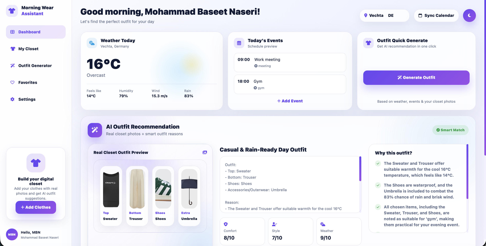
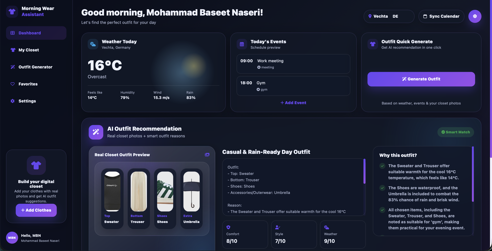
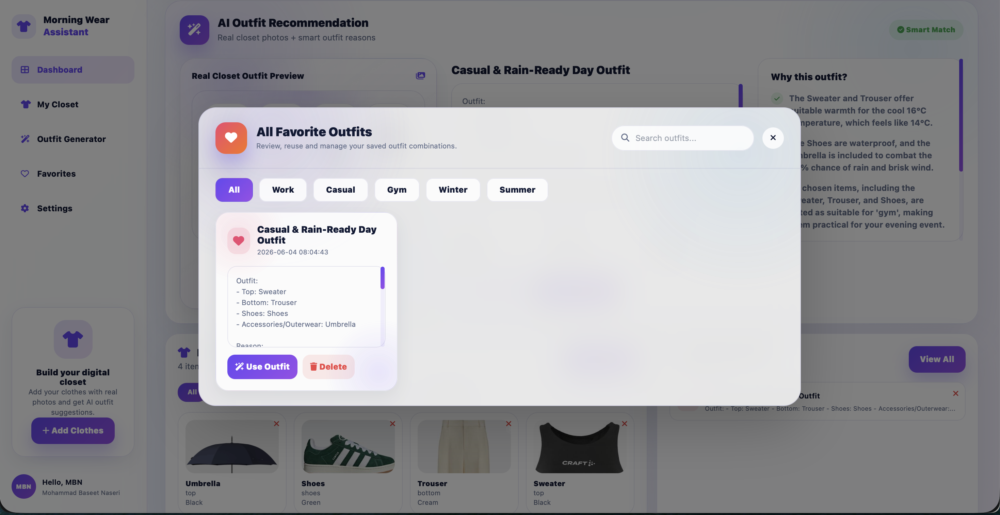
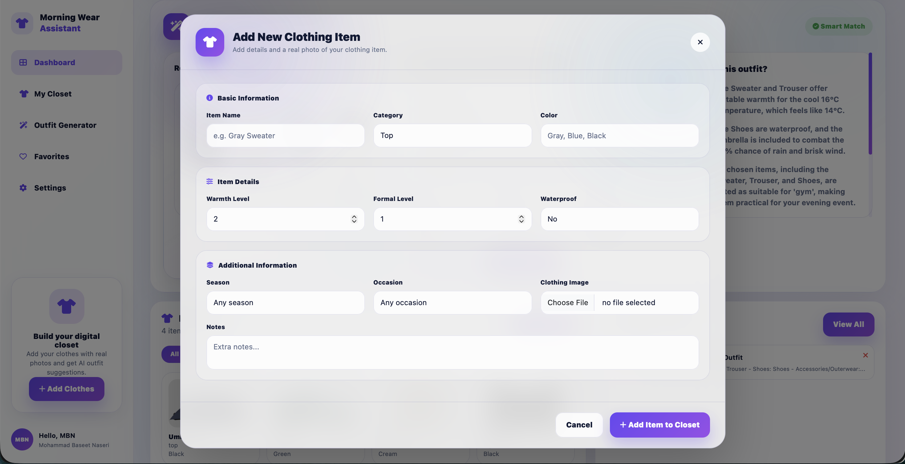

# Morning-Wear-Assistant-AI

### AI-Powered Smart Outfit Recommendation Platform

A modern AI-powered outfit recommendation system that helps users decide what to wear based on real-time weather conditions, daily schedule, and their personal digital wardrobe.

---

##  Overview

Morning Wear Assistant AI combines weather intelligence, event awareness and wardrobe management into one smart platform.

The application analyzes:

- Current weather conditions
- Daily events and activities
- User clothing inventory
- Clothing attributes

and generates personalized outfit recommendations using Artificial Intelligence.

Designed with a modern glassmorphism dashboard, responsive layouts, dark mode support and an intuitive user experience.

---

##  Core Features

###  Real-Time Weather Integration

* Current Temperature
* Feels-Like Temperature
* Humidity Monitoring
* Wind Speed Analysis
* Rain Probability Detection
* Location-Based Weather Forecast
* Open Meteo API Integration

###  AI Outfit Recommendation Engine

* Powered by Google Gemini AI
* Smart Outfit Generation
* Weather-Aware Recommendations
* Event-Aware Recommendations
* Personalized Clothing Suggestions
* Outfit Scoring System
* Practical Styling Advice

###  Digital Closet Management

* Add Clothing Items
* Digital Wardrobe Organization
* Color Management
* Warmth Level Tracking
* Formality Level Tracking
* Waterproof Item Tracking
* Seasonal Organization
* Occasion-Based Organization

### Favorite Outfit System

* Save Favorite Outfits
* Reuse Previous Recommendations
* Manage Saved Combinations
* Quick Outfit Access
* Favorite Outfit Library

### Premium User Experience

* Glassmorphism Dashboard
* Modern SaaS Design
* Responsive Layout
* Dark Mode
* Light Mode
* Interactive Components
* Mobile Friendly
* Smooth Animations

---

# Screenshots

## Main Dashboard (Light Mode)



---

## Main Dashboard (Dark Mode)



---

## AI Outfit Recommendation


---

## Favorite Outfits



---

## Add Clothing Items



---

# Project Structure

```text
Morning-Wear-Assistant-AI
│
├── app.py
├── db.py
├── services.py
├── requirements.txt
├── README.md
├── .gitignore
├── .env
│
├── templates/
│   └── index.html
│
├── static/
│   ├── style.css
│   ├── app.js
│   └── uploads/
│
├── screenshots/
│   ├── Main-light.png
│   ├── Main-dark.png
│   ├── AI-generate.png
│   ├── AI-favorite.png
│   └── Add-outfits.png
│
└── wardrobe.db
```

---

#  Technologies Used

## Backend

* Python
* Flask
* SQLite
* Google Gemini AI
* Open Meteo API
* Flask-CORS
* Python Dotenv

## Frontend

* HTML5
* CSS3
* JavaScript (ES6)
* Bootstrap 5
* Tailwind CSS
* Font Awesome

---

#  Installation Guide

## Clone Repository

```bash
git clone https://github.com/baseetnaseri6/Morning-Wear-Assistant-AI.git
```

## Open Project

```bash
cd Morning-Wear-Assistant-AI
```

## Create Virtual Environment

### macOS / Linux

```bash
python3 -m venv .venv
source .venv/bin/activate
```

### Windows

```bash
python -m venv .venv
.venv\Scripts\activate
```

---

## Install Dependencies

```bash
pip install -r requirements.txt
```

---

## Create Environment File

Create:

```text
.env
```

Add:

```env
FLASK_SECRET_KEY=your-secret-key
GEMINI_API_KEY=your-gemini-api-key
DEFAULT_CITY=Vechta
DEFAULT_COUNTRY=DE
```

---

## Run Application

```bash
python app.py
```

Open:

```text
http://127.0.0.1:5000
```

---

# How It Works

### Step 1

User adds clothing items to the digital wardrobe.

### Step 2

The system retrieves:

* Current Weather
* Temperature
* Humidity
* Rain Probability
* Wind Speed

### Step 3

Daily events are loaded.

### Step 4

Google Gemini AI analyzes:

* Weather Conditions
* Daily Schedule
* Closet Inventory
* Clothing Attributes

### Step 5

AI generates:

* Outfit Recommendation
* Comfort Score
* Style Score
* Weather Score
* Practical Advice

### Step 6

User can save recommendations into Favorites.

---

#  Supported Clothing Categories

### Tops

* T-Shirts
* Shirts
* Sweaters
* Hoodies

### Bottoms

* Jeans
* Trousers
* Chinos
* Shorts

### Shoes

* Sneakers
* Boots
* Running Shoes

### Outerwear

* Jackets
* Winter Coats
* Rain Coats

### Accessories

* Umbrellas
* Watches
* Scarves
* Gloves

---

#  Security

The following files should never be uploaded to GitHub:

```text
.env
venv/
.venv/
__pycache__/
*.db
*.sqlite3
```

Protected using:

```text
.gitignore
```

---

# APIs Used

## Google Gemini AI

Used for:

* Outfit Recommendation
* Smart Clothing Analysis
* Personalized Suggestions

## Open Meteo API

Used for:

* Weather Forecast
* Temperature Data
* Humidity Data
* Rain Prediction
* Wind Speed Data

---

# Future Roadmap

* Google Calendar Integration
* User Authentication
* Multi User Support
* Outfit History
* AI Style Learning
* Outfit Analytics
* Seasonal Reports
* Mobile Application
* Cloud Deployment
* Real Outfit Image Generation

---

#  Skills Demonstrated

* Python Development
* Flask Development
* REST API Development
* Frontend Development
* Responsive Web Design
* Database Design
* AI Integration
* Prompt Engineering
* Weather API Integration
* UI/UX Engineering

---

#  Author

## Mohammad Baseet Naseri

**AI Engineer • Full-Stack Developer • Network Engineer**

Portfolio  
https://naseriai.com

LinkedIn  
https://linkedin.com/in/baseetnaseri6

GitHub  
https://github.com/baseetnaseri6

---

# Support

If you like this project, please consider giving it a star ⭐ on GitHub.

---

# License

MIT License ©️ 2026 Mohammad Baseet Naseri
